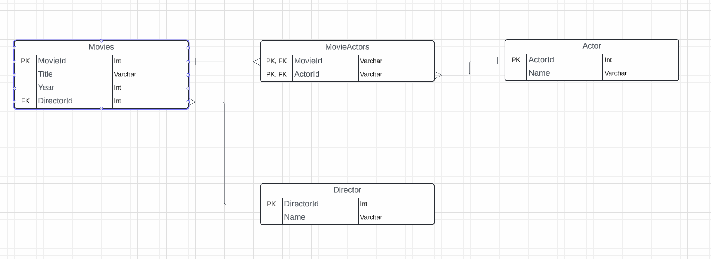

# Project setup


1. Start by creating a new folder for the project and open it in the VSCode
2. Write a main.py file for testing it. Maybe print(”Hello World!”)

3.Now Open terminal. (Shortcut ctrl + shift + ```)
4.Ensure it is in powershell. Or open it in powershell manually
5.Type the following command to create a new virtual environment
python3 -m venv myenv
6.Once it is created click on yes button for the prompt asking to add the virtual interpreter to the workspace  folder
7.Now, activate the scripts
source myenv\bin\activate
8.Now add a .gitignore file to ignore the myenv folder
9.Now create and Initialize a repository

10. pip install pyodbc

--> how to code in vs code using python for connectivity of database and python also for creating ,deleting,updating rows


To connect to a database using Python in Visual Studio Code (VS Code), create tables, insert rows, update rows, and delete rows, you can follow these steps:

Install the necessary extensions: In VS Code, install the Python extension and the SQL Server (mssql) extension if you're connecting to a SQL Server database.

Create a new Python file: Create a new Python file by clicking File > New File or by pressing Ctrl + N.
Install the required packages: Install the necessary packages for connecting to the database. For example, if you're connecting to a SQL Server database, you can install pyodbc using pip:

    ==>import pyodbc

Create a connection string: Create a connection string for your database. For example, for a SQL Server database, the connection string might look like this:
python

    ==>conn_str = (
        "DRIVER={ODBC Driver 17 for SQL Server};"
        "SERVER=your_server_name;"
        "DATABASE=your_database_name;"
        "UID=your_username;"
        "PWD=your_password;"
    )

Replace your_server_name, your_database_name, your_username, and your_password with the appropriate values for your database.

Create a connection: Create a connection to the database using the connection string:


    ==> conn = pyodbc.connect(conn_str)
Create a table: Create a table in the database using the connection:


    ==>cursor = conn.cursor()
    cursor.execute("""
        CREATE TABLE your_table (
            id INT PRIMARY KEY IDENTITY(1,1),
            name NVARCHAR(50) NOT NULL,
            age INT NOT NULL
        )
    """)
    conn.commit()
Replace your_table with the name of the table you want to create.

Insert rows: Insert rows into the table using the connection:

    ==>cursor.execute("INSERT INTO your_table (name, age) VALUES (?, ?)", ("Alice", 30))
    cursor.execute("INSERT INTO your_table (name, age) VALUES (?, ?)", ("Bob", 25))
    conn.commit()
    
Update rows: Update rows in the table using the connection:

    ==>cursor.execute("UPDATE your_table SET age = ? WHERE name = ?", (35, "Alice"))
    conn.commit()
    
Delete rows: Delete rows from the table using the connection:

    ==>cursor.execute("DELETE FROM your_table WHERE name = ?", ("Bob",))
       conn.commit()
       
Retrieve rows: Retrieve rows from the table using the connection:

    ==>cursor.execute("SELECT * FROM your_table")
       rows = cursor.fetchall()
       for row in rows:
          print(row)

Close the connection: Close the connection to the database when you're done:
python

    ==> conn.close()
    
This is a basic example of how to connect to a database using Python in VS Code, create tables, insert rows, update rows, and delete rows. Depending on the database you're using, the connection string and the SQL commands may be different.
